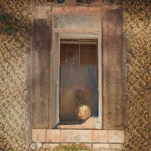
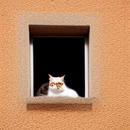
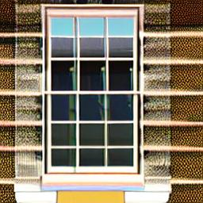
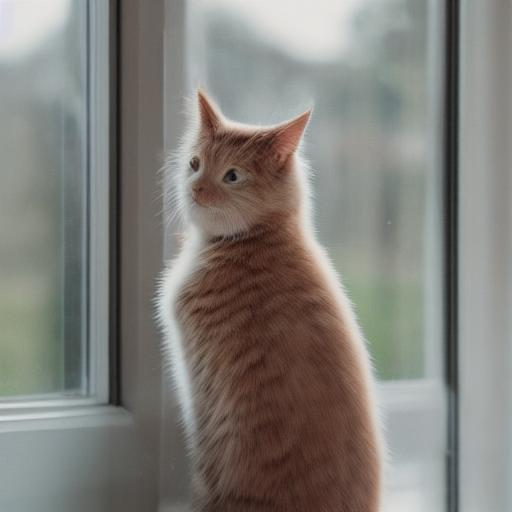
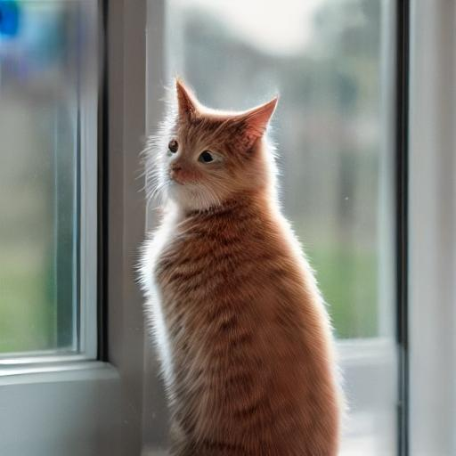

ページ：**01** | [02](02_overview.md) | [03](03_clip.md) | [04](04_conv2d.md) | [05](05_groupnorm.md) | [06](06_resblock.md) | [07](07_unet.md) | [08](08_cross_attention.md) | [09](09_ddim.md) | [10](10_vae.md) | [11](11_pipeline.md) | [12](12_lora.md) | [13](13_architecture.md)

---

# まず動かしてみよう

技術的な詳細に入る前に、SD 1.5 が実際にどう動くのかを体験しましょう。この章ではセットアップから画像生成まで、手を動かしながら SD 1.5 の振る舞いを観察します。

## セットアップ

依存関係をインストールします。

```bash
uv sync
```

SD 1.5 の重みファイルをダウンロードします。

```bash
make download
```

これにより、`weights/` ディレクトリに SD 1.5 のトークナイザと miniSD のモデルがダウンロードされます。miniSD は SD 1.4 を 256×256 向けにチューニングしたモデルで、CPU でも実用的な速度で画像を生成できます。SD 1.4 と 1.5 は内部アーキテクチャが同一のため、コードの変更なしにそのまま利用できます。

## 画像生成

プロンプト（指示文）を与えると、デフォルトの miniSD モデルがそれに沿った画像を生成します。

```bash
uv run my-sd15 -p "a cat sitting on a windowsill" --seed 123 -o output.jpg
```


GPT-2 が「次に来る単語を予測する」ことでテキストを生成したのに対し、SD 1.5 は「ノイズを少しずつ除去する」ことで画像を生成します。ランダムノイズから出発して、10 ステップのデノイジングを経て最終的な画像が得られます。

## パラメータの効果

いくつかのオプションで生成の振る舞いを調整できます。

### ステップ数 (`--steps`)

デノイジングの反復回数を指定します。多いほど品質が上がりますが、生成に時間がかかります。

```bash
uv run my-sd15 -p "a cat sitting on a windowsill" --seed 123 --steps 5 -o steps5.jpg
uv run my-sd15 -p "a cat sitting on a windowsill" --seed 123 --steps 10 -o steps10.jpg
uv run my-sd15 -p "a cat sitting on a windowsill" --seed 123 --steps 20 -o steps20.jpg
```

| steps=5 | steps=10 | steps=20 |
|:---:|:---:|:---:|
|  |  |  |

ステップ数が少ないとノイズが残り、多すぎると過度にシャープになる傾向があります。本来 30 程度は必要ですが、10 ステップは画像の形状が認識できる最低ラインです。細部は甘くなりますが、時間節約のため以降はこの設定を使います。

### CFG スケール (`--cfg`)

Classifier-Free Guidance (CFG) スケールは、テキスト条件にどの程度忠実に従うかを制御します。

```bash
uv run my-sd15 -p "a cat sitting on a windowsill" --seed 123 --cfg 1.0 -o cfg1.jpg
uv run my-sd15 -p "a cat sitting on a windowsill" --seed 123 --cfg 7.5 -o cfg7.jpg
uv run my-sd15 -p "a cat sitting on a windowsill" --seed 123 --cfg 15.0 -o cfg15.jpg
```

| cfg=1.0 | cfg=7.5 | cfg=15.0 |
|:---:|:---:|:---:|
|  |  |  |

CFG 1.0 ではプロンプトの影響が弱くぼんやりした画像、7.5 はバランスの良いデフォルト、15.0 ではプロンプトに強く従いますがコントラストが高くなりすぎることがあります。GPT-2 の temperature と似た役割ですが、方向が逆です（高いほどプロンプトに忠実）。

### シード値 (`--seed`)

乱数のシード値を指定します。同じシードなら同じ画像が再現されます。

```bash
uv run my-sd15 -p "a cat sitting on a windowsill" --seed 42 -o seed42.jpg
uv run my-sd15 -p "a cat sitting on a windowsill" --seed 123 -o seed123.jpg
uv run my-sd15 -p "a cat sitting on a windowsill" --seed 456 -o seed456.jpg
```

| seed=42 | seed=123 | seed=456 |
|:---:|:---:|:---:|
|  |  |  |

GPT-2 でもシードを固定するとサンプリング結果が再現されましたが、SD 1.5 ではシードが初期ノイズを決定するため、画像全体の構図が大きく変わります。

### Negative Prompt (`-n`)

生成したくない要素を指定します。

```bash
uv run my-sd15 -p "a cat sitting on a windowsill" --seed 123 -n "blurry, low quality" -o neg.jpg
```


Negative Prompt は CFG の仕組みを利用して、指定した要素を画像から「遠ざける」方向に働きます。詳しくは [11 章](11_pipeline.md)で解説します。

## 別モデルでの生成

`-m` オプションでモデルを切り替えられます。SD 1.5 のフル重みで生成するには、まず `make download-sd15` でダウンロードしてから以下を実行します。

```bash
uv run my-sd15 -m stable-diffusion-v1-5/stable-diffusion-v1-5 -p "a cat sitting on a windowsill" --seed 123 -o sd15.jpg
```



SD 1.5 は 512×512 で訓練されているため、デフォルトの 256×256 ではまともな画像が生成できません。`-W 512 -H 512` を指定すればプロンプト通りの画像が得られますが、CPU では数分かかります。

アニメ風の画像を生成する Anything V5 も `make download-any5` で追加できます。

```bash
uv run my-sd15 -m genai-archive/anything-v5 -p "a cat sitting on a windowsill" --seed 123 -o any5.jpg
```


重みを差し替えるだけで、画風が大きく変わります。これはモデルの構造ではなく、学習データの違いによるものです。

## LCM LoRA による高速生成

LoRA (Low-Rank Adaptation) は、学習済みモデルの重みを少量のパラメータで修正する手法です。ここでは LCM (Latent Consistency Model) LoRA を使い、通常 10 ステップ以上かかるデノイジングを **2～4 ステップ**に短縮します。

まず LCM LoRA の重みをダウンロードします。

```bash
make download-lcm
```

`--lora` で LoRA ファイルを指定し、`--lcm` で LCM 専用スケジューラーを有効にします。LCM LoRA は CFG を内部に取り込んでいるため `--cfg 1.0` とし、ステップ数は `--steps 2` にします。

```bash
uv run my-sd15 -m stable-diffusion-v1-5/stable-diffusion-v1-5 \
  --lora latent-consistency/lcm-lora-sdv1-5 \
  --lcm --steps 3 --cfg 1.0 -W 512 -H 512 \
  -p "a cat sitting on a windowsill" --seed 42 -o lcm.jpg
```



LCM LoRA の仕組みについては [12 章](12_lora.md)で詳しく解説します。

## TAESD による高速プレビュー

TAESD (Tiny AutoEncoder) は、VAE デコーダーの軽量版です。`--vae` オプションで通常の VAE と差し替えて使います。

```bash
make download-taesd
```

```bash
uv run my-sd15 -m stable-diffusion-v1-5/stable-diffusion-v1-5 \
  --lora latent-consistency/lcm-lora-sdv1-5 \
  --lcm --steps 3 --cfg 1.0 -W 512 -H 512 \
  --vae madebyollin/taesd \
  -p "a cat sitting on a windowsill" --seed 42 -o taesd.jpg
```



LCM LoRA との併用で最も効果を発揮します。ただし画像はやや不鮮明になるため、まず TAESD で素早く試行錯誤し、気に入った seed やプロンプトが見つかったら通常の VAE（`--vae` なし）で再生成するという使い方がお勧めです。

## まとめ

この章では SD 1.5 をブラックボックスとして使い、プロンプト・ステップ数・CFG スケール・シード・Negative Prompt・LoRA といったパラメータが生成結果にどう影響するかを体験しました。次章からは、このパイプラインの内部でどのような計算が行われているかを順に解きほぐしていきます。

---

ページ：**01** | [02](02_overview.md) | [03](03_clip.md) | [04](04_conv2d.md) | [05](05_groupnorm.md) | [06](06_resblock.md) | [07](07_unet.md) | [08](08_cross_attention.md) | [09](09_ddim.md) | [10](10_vae.md) | [11](11_pipeline.md) | [12](12_lora.md) | [13](13_architecture.md)
