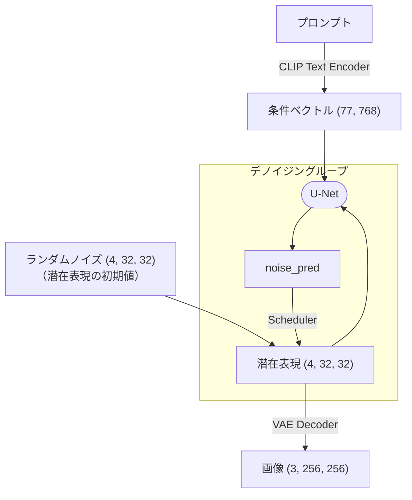

ページ：[01](01_quickstart.md) | **02** | [03](03_clip.md) | [04](04_conv2d.md) | [05](05_groupnorm.md) | [06](06_resblock.md) | [07](07_unet.md) | [08](08_cross_attention.md) | [09](09_ddim.md) | [10](10_vae.md) | [11](11_pipeline.md) | [12](12_lora.md) | [13](13_architecture.md)

---

# 推論パイプラインの全体像

Stable Diffusion 1.5 (SD 1.5) は、2022 年に公開されたテキストから画像を生成する拡散モデルです。約 10 億のパラメータで構成されています。

SD 1.5 の推論パイプラインは、テキストから画像を生成する一連の処理です。GPT-2 が「トークンを 1 つずつ左から右へ生成する」自己回帰モデルだったのに対し、SD 1.5 は「ノイズから画像全体を徐々に浮かび上がらせる」**拡散モデル**です。なお、テキスト生成に拡散モデルを適用する研究もありますが、現時点では自己回帰モデルが主流です。

## 推論パイプラインの構成

SD 1.5 は Latent Diffusion Model (LDM) をベースにしており、画像のピクセルを直接扱うのではなく、**潜在表現**（latents）の空間でノイズ除去を行います。256×256 の画像は 4×32×32 の潜在表現に対応し、縦横比が 1/8 になるため計算コストが大幅に削減されます。最後に VAE Decoder が潜在表現をピクセル画像に復元します。

以下の 4 つのコンポーネントが協調して動作します。

| コンポーネント | パラメータ数 | 役割 |
|---|---|---|
| CLIP Text Encoder | 123M | テキストを条件ベクトルに変換（👉[03](03_clip.md)） |
| U-Net | 860M | ノイズを予測（👉[07](07_unet.md)） |
| Scheduler | なし | デノイジングの反復計算（👉[09](09_ddim.md)） |
| VAE Decoder | 84M | 潜在表現を画像に変換（👉[10](10_vae.md)） |

256×256 の画像を生成するフローを示します。

1. **CLIP Text Encoder** — プロンプトをトークン化し、77×768 の条件ベクトルに変換
2. **ランダムノイズ生成** — シード値から 4×32×32 の初期ノイズを生成
3. **デノイジングループ** — U-Net がノイズを予測し、Scheduler がそのノイズを除去
4. **VAE Decoder** — 潜在表現（4×32×32）をピクセル画像（3×256×256）に変換



## 推論パイプラインの実装

推論パイプラインの中核部分のコードを示します。デノイジングループでノイズを除去していきます。

```python
# Step 1: テキスト → 条件ベクトル
cond = text_encoder(tokenizer.encode(prompt))
uncond = text_encoder(tokenizer.encode(negative_prompt))

# Step 2: ランダムノイズ生成
latents = torch.randn(4, height // 8, width // 8)

# Step 3: デノイジングループ — U-Net がノイズを予測し、Scheduler が除去
for t in scheduler.timesteps:
    noise_cond = unet(latents, t, cond)
    noise_uncond = unet(latents, t, uncond)
    noise_pred = noise_uncond + cfg_scale * (noise_cond - noise_uncond)  # CFG
    latents = scheduler.step(noise_pred, t, latents)

# Step 4: VAE Decoder — 潜在表現をピクセル画像に変換
image = vae(latents)
```

Step 3 では U-Net を 2 回実行しています。`noise_cond` はプロンプトに従ったノイズ予測、`noise_uncond` はネガティブプロンプトに従ったノイズ予測です。両者の差がプロンプトの「効き目」を表しています。この差を `cfg_scale`（デフォルト 7.5）倍に増幅してプロンプトへの忠実度を高める手法を **CFG (Classifier-Free Guidance)** と呼びます（👉[11](11_pipeline.md)）。

## 拡散の直感

なぜランダムなノイズから画像を生成できるのでしょうか。

基本的なアイデアは「画像にノイズを加えていくと、最終的には純粋なノイズになる」という事実の逆転です。もしノイズを**少しだけ除去する**方法を学習できれば、純粋なノイズから出発して、少しずつノイズを除去することで画像が得られます。U-Net はまさにこの「ノイズ除去の 1 ステップ」を学習したモデルです。

デノイジングの過程を視覚的に見てみましょう。ステップ 0 は純粋なノイズ、ステップ 10 が最終画像です。左列は潜在空間の生データ（4 成分を赤・緑・青・シアンに割り当てた加法混色で表示）、右列が VAE でデコードしたピクセル画像です。実際のパイプラインでは VAE Decoder は最終ステップの後に 1 回だけ適用されますが、ここでは中間ステップの latents がどのような状態かを確認するために各ステップで VAE デコードしています。

| ステップ | Latent | VAE デコード |
|----------|-------------------|-------------|
| 0 |  |  |
| 3 |  |  |
| 5 |  |  |
| 7 |  |  |
| 10 |  |  |

ステップが進むにつれて、ノイズの中から画像の構造が徐々に現れる様子が分かります。また、Latent の構造が画像の構造とある程度対応していることが観察されます。

この過程は、人間が雲や壁のシミなどに顔を見出す「[パレイドリア](https://ja.wikipedia.org/wiki/%E3%83%91%E3%83%AC%E3%82%A4%E3%83%89%E3%83%AA%E3%82%A2)」と似た構造を持っています。U-Net はランダムノイズに対して、学習した画像の確率分布とプロンプトの条件を手がかりに「この潜在表現はどんな画像であるべきか」を推論し、ステップごとにその解釈を強めていきます。途中段階のぼんやりしたシルエットが徐々に被写体として収束していく様子は、まさにモデルがノイズの中からパターンを削り出していく過程そのものです。

デノイジング過程の全ステップは「[デノイジングステップの可視化](../steps/README.md)」で確認できます。

## GPT-2 との対比

GPT-2 との最大の共通点は CLIP Text Encoder です。「Text Encoder」という名前ですが、Transformer としての構造は Encoder ではなく GPT-2 と同じ Decoder で、内部構造（Embedding・Attention・LayerNorm・残差接続・MLP）はほぼ同一です（👉[03](03_clip.md)）。GPT-2 では Transformer の出力から次のトークンを予測しますが、CLIP ではテキスト全体を条件ベクトルにエンコードするために使います。

SD 1.5 は画像を扱うため、GPT-2 にはなかった概念が加わります。

- **Conv2D** — 畳み込み演算。画像の局所的な特徴を抽出（👉[04](04_conv2d.md)）
- **GroupNorm** — チャネル方向の正規化。画像処理に適した正規化手法（👉[05](05_groupnorm.md)）
- **Cross-Attention** — テキスト条件を画像特徴に注入する仕組み（👉[08](08_cross_attention.md)）
- **拡散過程** — ノイズの付加と除去の数理（👉[09](09_ddim.md)）
- **VAE** — 潜在空間とピクセル空間の変換（👉[10](10_vae.md)）
- **LoRA** — 学習済み重みに低ランクの差分を加えて振る舞いを変更（👉[12](12_lora.md)）

## 実験：パイプラインの各段階を追跡

各コンポーネントの入出力テンソル形状を追跡し、データがどのように変換されるかを確認します。注目すべき点は、パイプライン全体を通じて空間サイズが 32×32 のまま処理され、最後の VAE Decoder で 256×256 に拡大されることです。潜在空間での処理がいかに効率的かが分かります。

**実行方法**: ([02_overview.py](02_overview.py))

```bash
uv run docs/02_overview.py
```

---

ページ：[01](01_quickstart.md) | **02** | [03](03_clip.md) | [04](04_conv2d.md) | [05](05_groupnorm.md) | [06](06_resblock.md) | [07](07_unet.md) | [08](08_cross_attention.md) | [09](09_ddim.md) | [10](10_vae.md) | [11](11_pipeline.md) | [12](12_lora.md) | [13](13_architecture.md)
