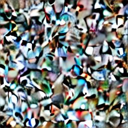
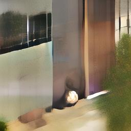
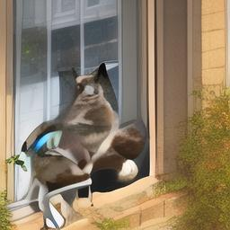
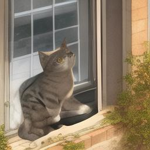
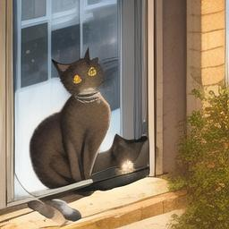

ページ：[01](01_quickstart.md) | [02](02_overview.md) | [03](03_clip.md) | [04](04_conv2d.md) | [05](05_groupnorm.md) | [06](06_resblock.md) | [07](07_unet.md) | [08](08_cross_attention.md) | **09** | [10](10_vae.md) | [11](11_pipeline.md) | [12](12_lora.md) | [13](13_architecture.md)

---

# DDIM Scheduler: ノイズ除去の数理

SD 1.5 のパイプラインでは、ランダムノイズから画像を生成するために「ノイズを少しずつ除去する」プロセスを繰り返します。この反復の各ステップを管理するのが **DDIM Scheduler** です。

1. テキスト
   - [CLIP Text Encoder](03_clip.md)
2. 条件ベクトル
3. ランダムノイズ
   - U-Net × 10 step
     - [Conv2D](04_conv2d.md)
     - [GroupNorm](05_groupnorm.md)
     - [ResBlock](06_resblock.md)
     - [Cross-Attention](08_cross_attention.md)
   - **DDIM Scheduler** ← この章
4. 潜在表現
   - [VAE Decoder](10_vae.md)
5. 画像

## 1. 拡散モデルの考え方

拡散モデルは 2 つの過程で成り立っています。

**前方過程（学習時）**: きれいな画像にノイズを少しずつ加えて、最終的に純粋なガウスノイズにする。

```
画像 → 少しノイズ → もっとノイズ → ... → 純粋なノイズ
x_0  →    x_1    →    x_2     → ... →    x_999
```

**逆過程（推論時）**: ノイズから出発して、少しずつノイズを除去して画像を復元する。U-Net が「このノイズはどう見えるべきか」を予測します。

```
純粋なノイズ → 少しきれい → もっときれい → ... → 画像
x_999       →    x_900   →    x_800    → ... →  x_0
```

推論時に行うのは逆過程だけです。前方過程は学習時にのみ使われます。

## 2. ノイズスケジュール

前方過程の各ステップでどれだけノイズを加えるかを決めるのが**ノイズスケジュール**です。SD 1.5 は `scaled_linear` スケジュールを使います。

```python
betas = torch.linspace(0.00085 ** 0.5, 0.012 ** 0.5, 1000) ** 2
```

$\beta_t$ は各ステップのノイズ強度で、$t=0$ では小さく (0.00085) 、$t=999$ では大きく (0.012) なります。平方根の空間で線形に増加させることで、ノイズの増加を滑らかにしています。

$\beta_t$ から累積積 $\bar{\alpha}_t$ を計算します。

```python
alphas = 1.0 - betas
alphas_cumprod = torch.cumprod(alphas, dim=0)  # ᾱ_t
```

$\bar{\alpha}_t$ は「ステップ $t$ でどれだけ元の画像が残っているか」を表します。

- $t=0$: $\bar{\alpha}_0 \approx 0.999$（ほぼ元の画像）
- $t=999$: $\bar{\alpha}_{999} \approx 0.006$（ほぼ純粋なノイズ）

前方過程は次の式で表せます。

$$x_t = \sqrt{\bar{\alpha}_t} \cdot x_0 + \sqrt{1 - \bar{\alpha}_t} \cdot \epsilon$$

ここで $\epsilon$ は標準ガウスノイズです。任意のステップ $t$ の $x_t$ を、$x_0$ と $\epsilon$ から直接計算できます（中間ステップを経由する必要がありません）。

## 3. タイムステップの選択

学習時は 1000 ステップですが、推論時は 10 ステップに間引きます。

```python
def set_timesteps(self, num_steps):
    step_ratio = 1000 / num_steps  # 100
    ts = torch.round(torch.arange(0, num_steps).float() * step_ratio).long()
    self.timesteps = ts.flip(0)  # 大→小の順
```

10 ステップの場合、タイムステップは `[900, 800, 700, 600, 500, 400, 300, 200, 100, 0]` になります。1000 ステップの等間隔な部分集合を選ぶことで、少ないステップ数でも品質を保ちます。

ステップ数による生成品質の変化は以下のとおりです。

| steps=1 | steps=3 | steps=5 | steps=7 | steps=9 |
|:---:|:---:|:---:|:---:|:---:|
|  |  |  |  |  |

初期ステップでは $\bar{\alpha}_t$ が小さくノイズが支配的なため、U-Net は画像全体の構図や色調（低周波成分）を予測します。ステップが進み $\bar{\alpha}_t$ が大きくなると、ノイズが減って高周波成分（エッジ・テクスチャ）の予測に移ります。そのため大構造が先に決まり、細部は後から描き込まれます。各ステップの中間画像は [steps/README.md](../steps/README.md) で確認できます。

## 4. DDIM ステップ

DDIM (Denoising Diffusion Implicit Models) は、決定的 ($\eta=0$) なデノイジングステップを定義します。SD 1.5 のデフォルトスケジューラである PNDM では実用的な品質を得るのに 50 ステップ程度が必要ですが、DDIM は 10 ステップ程度でも比較的鮮明な画像が得られます。更新式もシンプルで実装が容易なため、本プロジェクトでは DDIM を採用しています。

各ステップで U-Net が予測したノイズ $\epsilon_\theta$ を使い、次の潜在表現を計算します。

### ステップ 1: $x_0$ の予測

U-Net の出力（予測ノイズ）から、元のきれいな画像 $x_0$ を推定します。

$$\hat{x}_0 = \frac{x_t - \sqrt{1 - \bar{\alpha}_t} \cdot \epsilon_\theta}{\sqrt{\bar{\alpha}_t}}$$

これは前方過程の式を $x_0$ について解いたものです。

### ステップ 2: 前のタイムステップへ移動

推定した $\hat{x}_0$ と予測ノイズ $\epsilon_\theta$ を使って、前のタイムステップ $t_{prev}$ の潜在表現を計算します。

$$x_{t_{prev}} = \sqrt{\bar{\alpha}_{t_{prev}}} \cdot \hat{x}_0 + \sqrt{1 - \bar{\alpha}_{t_{prev}}} \cdot \epsilon_\theta$$

### 実装

```python
def step(self, noise_pred, t, sample):
    alpha_t = self.alphas_cumprod[t]
    t_prev = t - int(self._step_ratio)
    alpha_t_prev = self.alphas_cumprod[t_prev] if t_prev >= 0 else torch.tensor(1.0)
    # x_0 の予測
    pred_x0 = (sample - torch.sqrt(1.0 - alpha_t) * noise_pred) / torch.sqrt(alpha_t)
    # 前のステップの計算
    prev_sample = torch.sqrt(alpha_t_prev) * pred_x0 + torch.sqrt(1.0 - alpha_t_prev) * noise_pred
    return prev_sample
```

$t_{prev} < 0$（最終ステップ）の場合は $\bar{\alpha}_{t_{prev}} = 1.0$ とし、$x_{t_{prev}} = \hat{x}_0$ になります。つまり最終ステップでは予測した $x_0$ がそのまま出力されます。

$\eta=0$ なので確率的なノイズ項はなく、同じ入力からは常に同じ出力が得られます。これが同じシードで同じ画像が再現される理由です。

## 実験：DDIM Scheduler の動作確認

ノイズスケジュールの値、タイムステップの選択、DDIM ステップの計算など、本文中の数値を確認するためのスクリプトです。

**実行方法**: ([09_ddim.py](09_ddim.py))

```bash
uv run docs/09_ddim.py
```

---

ページ：[01](01_quickstart.md) | [02](02_overview.md) | [03](03_clip.md) | [04](04_conv2d.md) | [05](05_groupnorm.md) | [06](06_resblock.md) | [07](07_unet.md) | [08](08_cross_attention.md) | **09** | [10](10_vae.md) | [11](11_pipeline.md) | [12](12_lora.md) | [13](13_architecture.md)
