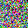
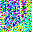
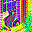

ページ：[01](01_quickstart.md) | [02](02_overview.md) | [03](03_clip.md) | [04](04_conv2d.md) | [05](05_groupnorm.md) | [06](06_resblock.md) | [07](07_unet.md) | [08](08_cross_attention.md) | [09](09_ddim.md) | **10** | [11](11_pipeline.md) | [12](12_lora.md) | [13](13_architecture.md)

---

# VAE Decoder: 潜在空間から画像へ

デノイジングが完了した潜在表現 `(4, 32, 32)` を、人間が見られるピクセル画像 `(3, 256, 256)` に変換するのが **VAE Decoder** です。

1. テキスト
   - [CLIP Text Encoder](03_clip.md)
2. 条件ベクトル
3. ランダムノイズ
   - U-Net × 10 step
     - [Conv2D](04_conv2d.md)
     - [GroupNorm](05_groupnorm.md)
     - [ResBlock](06_resblock.md)
     - [Cross-Attention](08_cross_attention.md)
4. 潜在表現
   - **VAE Decoder** ← この章
5. 画像

## 1. なぜ潜在空間で処理するのか

SD 1.5 は 256×256×3 のピクセル画像を直接扱わず、32×32×4 の**潜在表現**で処理します。

| | ピクセル空間 | 潜在空間 |
|---|---|---|
| サイズ | (3, 256, 256) | (4, 32, 32) |
| 要素数 | 196,608 | 4,096 |
| 圧縮率 | 1× | **48 倍圧縮** |

U-Net のデノイジングはステップごとに全パラメータを使った推論を行うため、48 倍の圧縮は計算コストに直結します。潜在空間での処理により、画質をほぼ維持しながら大幅に高速化できます。

## 2. 潜在表現 vs ピクセル画像

デノイジング過程の各ステップで、潜在表現とピクセル画像を比較してみましょう。

| ステップ | Latent（先頭 3ch を表示） | VAE デコード |
|----------|--------------------------|-------------|
| 0 |  |  |
| 5 |  |  |
| 10 |  |  |

左列の Latent は 4 チャネルのうち先頭 3 つを RGB として可視化したものです。人間には意味のわからないパターンですが、VAE Decoder を通すと（右列）意味のある画像が現れます。VAE は「潜在空間の圧縮表現をピクセル空間に展開する辞書」のような役割を果たしています。

全ステップの可視化は「[デノイジングステップの可視化](../steps/README.md)」を参照してください。

## 3. VAE Decoder の構造

```
潜在表現 (4, 32, 32)
  ↓ post_quant_conv (1×1)
  ↓ conv_in (3×3)
(512, 32, 32)
  ↓ Mid block: ResBlock → Attention → ResBlock
(512, 32, 32)
  ↓ Up block 0: ResBlock×3 → upsample
(512, 64, 64)
  ↓ Up block 1: ResBlock×3 → upsample
(512, 128, 128)
  ↓ Up block 2: ResBlock×3 (512→256) → upsample
(256, 256, 256)
  ↓ Up block 3: ResBlock×3 (256→128)
(128, 256, 256)
  ↓ GroupNorm → SiLU → conv_out (3×3)
画像 (3, 256, 256)
```

空間サイズが 32→64→128→256 と 4 回のアップサンプリングで 8 倍に拡大されます（$2^3 = 8$、ただし 4 回アップサンプルのうち最後のブロックはアップサンプルなし）。

## 4. VaeAttention

VAE Decoder の Mid block には **VaeAttention** が 1 つだけ含まれています。U-Net の CrossAttention と異なり、**単一ヘッド**の Self-Attention です。

```python
class VaeAttention:
    def __call__(self, x):
        C, H, W = x.shape
        h = group_norm(x, ...)
        h = h.reshape(C, H * W).T        # (H*W, C)
        q = linear(h, ...)
        k = linear(h, ...)
        v = linear(h, ...)
        attn = softmax(q @ k.T / (C ** 0.5))  # 単一ヘッド
        h = attn @ v
        h = linear(h, ...)
        h = h.T.reshape(C, H, W)
        return x + h                      # 残差接続
```

| | VaeAttention | U-Net CrossAttention |
|---|---|---|
| ヘッド数 | 1 | 8 |
| 外部条件 | なし（Self-Attention のみ） | テキスト埋め込み |
| スケール | $1/\sqrt{C}$ | $1/\sqrt{d_{head}}$ |

VaeAttention は空間方向の Self-Attention で、潜在表現の各ピクセル間の関係を捉えます。SpatialTransformer（👉[08](08_cross_attention.md)）と同じ `reshape(C, H*W).T` による 2D→系列変換を使います。

## 5. スケーリング係数

VAE Decoder に渡す前に、潜在表現を定数 **0.18215** で割ります。

```python
decoded = model.vae(latents / 0.18215)
```

この値は VAE の学習時に潜在空間の分散を調整するために導入されたスケーリング係数です。学習済みモデルに固有の定数であり、SD 1.5 では常にこの値を使います。

## 6. TAESD: 軽量 VAE デコーダー

[TAESD (Tiny AutoEncoder for Stable Diffusion)](https://huggingface.co/madebyollin/taesd) は、SD 1.5 の VAE Decoder を蒸留（distillation）で軽量化したモデルです。

### 構造の比較

| | VAE Decoder | TAESD Decoder |
|---|---|---|
| パラメータ数 | 約 4,900 万 | 約 120 万（**約 1/40**） |
| ファイルサイズ | 160 MB (fp16) | 9.4 MB (fp32) |
| チャネル数 | 512→256→128 | **64 固定** |
| Attention | あり（Mid block） | **なし** |
| GroupNorm | あり | **なし** |
| 活性化関数 | SiLU | **ReLU** |
| 基本構成 | ResBlock + Attention | **Conv + ReLU のみ** |

TAESD は `nn.Sequential` に 19 層がフラットに格納されたシンプルな構造で、Conv2D と ReLU だけで構成されています。Attention や GroupNorm を排除することで、パラメータ数とデコード時間の両方を大幅に削減しています。

VAE Decoder と同じく 3 回のアップサンプリングで空間サイズを 8 倍に拡大しますが、チャネル数は全層 64 固定で、Attention や GroupNorm は一切使いません。この単純さが軽量化の鍵です。

### 実装の比較

使う基本演算（`conv2d`、`upsample_nearest_2d`）は VAE Decoder と同じですが、構成要素が大幅に削減されています。

**ResBlock**: VAE では GroupNorm → SiLU → Conv を 2 回重ね、skip 後の活性化はありません。TAESD では Conv → ReLU を 3 回重ね、skip 後に ReLU を適用します。

```python
# VaeResBlock
h = silu(group_norm(x, ...))
h = conv2d(h, ...)
h = silu(group_norm(h, ...))
h = conv2d(h, ...)
return x + h

# TaesdResBlock
h = relu(conv2d(x, ...))
h = relu(conv2d(h, ...))
h = conv2d(h, ...)
return relu(h + x)
```

**アップサンプル**: VAE ではアップサンプル後に bias 付き Conv を通しますが、TAESD では **bias なし**の Conv です。

```python
# VaeDecoder
x = upsample_nearest_2d(x, 2)
x = conv2d(x, weight, bias, padding=1)

# TaesdDecoder
x = upsample_nearest_2d(x, 2)
x = conv2d(x, weight, padding=1)  # bias なし
```

**出力のスケーリング**: VAE Decoder は `[-1, 1]` 範囲の値を出力しますが、TAESD は `[0, 1]` 範囲で出力するため、後段で変換します。

```python
# VaeDecoder: そのまま [-1, 1] を出力
x = silu(group_norm(x, ...))
x = conv2d(x, ...)
return x

# TaesdDecoder: [0, 1] → [-1, 1] に変換
x = conv2d(x, ...)
return x * 2 - 1
```

**不要になった演算**: TAESD では `group_norm`、`silu`、`linear`、`softmax` が一切使われません。Attention（`linear` + `softmax`）と正規化（`group_norm`）の除去が、軽量化の最大の要因です。

## 実験：VAE Decoder の動作確認

VAE Decoder の入出力形状や圧縮率など、本文中の数値を確認するためのスクリプトです。

**実行方法**: ([10_vae.py](10_vae.py))

```bash
uv run docs/10_vae.py
```

---

ページ：[01](01_quickstart.md) | [02](02_overview.md) | [03](03_clip.md) | [04](04_conv2d.md) | [05](05_groupnorm.md) | [06](06_resblock.md) | [07](07_unet.md) | [08](08_cross_attention.md) | [09](09_ddim.md) | **10** | [11](11_pipeline.md) | [12](12_lora.md) | [13](13_architecture.md)
