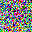
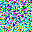
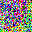
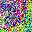
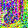
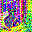
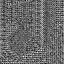
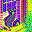

ページ：[01](01_quickstart.md) | [02](02_overview.md) | [03](03_clip.md) | [04](04_conv2d.md) | [05](05_groupnorm.md) | [06](06_resblock.md) | [07](07_unet.md) | [08](08_cross_attention.md) | [09](09_ddim.md) | [10](10_vae.md) | **11** | [12](12_architecture.md)

---

# パイプライン統合: テキストから画像へ

これまでの章で個別に学んだコンポーネントが、パイプラインとしてどのように組み合わさるかを見ていきます。中心となるのは **Classifier-Free Guidance (CFG)** という仕組みです。

1. テキスト
   - [CLIP Text Encoder](03_clip.md)
2. 条件ベクトル
3. ランダムノイズ
   - [U-Net](07_unet.md) × 10 step
   - [DDIM Scheduler](09_ddim.md)
4. 潜在表現
   - [VAE Decoder](10_vae.md)
5. 画像
   - **パイプライン統合** ← この章

## 1. パイプライン全体のコード

`model.py` の `generate()` メソッドが全体の流れを実装しています。

```python
def generate(self, prompt, negative_prompt="", seed=None, steps=10,
             cfg_scale=7.5, height=256, width=256):
    self.scheduler.set_timesteps(steps)

    # 1. テキストを条件ベクトルに変換
    cond_emb = self.text_encoder(self.tokenizer.encode(prompt))
    uncond_emb = self.text_encoder(self.tokenizer.encode(negative_prompt))

    # 2. ランダムノイズ生成
    generator = torch.manual_seed(seed) if seed is not None else None
    latents = torch.randn(4, height // 8, width // 8, generator=generator)

    # 3. デノイジングループ
    with torch.no_grad():
        for t in self.scheduler.timesteps:
            t_int = int(t)
            noise_cond = self.unet(latents, t_int, cond_emb)
            noise_uncond = self.unet(latents, t_int, uncond_emb)
            noise_pred = noise_uncond + cfg_scale * (noise_cond - noise_uncond)
            latents = self.scheduler.step(noise_pred, t_int, latents)

    # 4. VAE デコード
    return decode_to_image(self.vae(latents / 0.18215))
```

わずか 20 行足らずのコードで、テキストから画像が生成されます。

## 2. Classifier-Free Guidance (CFG)

パイプラインの核心は、デノイジングループ内の 3 行です。

```python
noise_cond = self.unet(latents, t_int, cond_emb)      # 条件付きノイズ予測
noise_uncond = self.unet(latents, t_int, uncond_emb)   # 無条件ノイズ予測
noise_pred = noise_uncond + cfg_scale * (noise_cond - noise_uncond)
```

U-Net を **2 回** 実行します。

1. **条件付き** (`cond_emb`): 「a cat sitting on a windowsill」を条件にしたノイズ予測
2. **無条件** (`uncond_emb`): 空文字列を条件にしたノイズ予測（テキスト条件なし）

そして、2 つの予測の**差分を増幅**して最終的なノイズ予測とします。

$$\epsilon_{final} = \epsilon_{uncond} + s \cdot (\epsilon_{cond} - \epsilon_{uncond})$$

ここで $s$ は `cfg_scale` です。

### CFG の直感

- $s = 1.0$: 条件付きノイズ予測をそのまま使う（ガイダンスなし）
- $s = 7.5$: 条件と無条件の差を 7.5 倍に増幅（デフォルト）
- $s = 15.0$: さらに強く増幅（プロンプトに強く従う）

「条件付きと無条件の差」は「テキスト条件が画像にどう影響するか」を表します。この差を増幅することで、テキストに忠実な画像が生成されます。GPT-2 の temperature が「確率分布の鋭さ」を制御したのと対照的に、CFG は「条件付けの強さ」を制御します。

## 3. Negative Prompt

`uncond_emb` に空文字列の代わりにテキストを入れると、**Negative Prompt** になります。

```python
uncond_emb = self.text_encoder(self.tokenizer.encode(negative_prompt))
```

例えば `negative_prompt="blurry, low quality"` とすると、「ぼやけた低品質な画像」に向かうノイズ予測が `uncond_emb` 側になります。CFG の式で差分を取ることで、その方向から**遠ざかる**効果が生まれます。

つまり Negative Prompt は特別な仕組みではなく、CFG の「無条件」側にテキストを入れるだけです。

## 4. デノイジング過程の可視化

10 ステップのデノイジング過程で、潜在表現と画像がどう変化するかを見ましょう。

| ステップ | Latent | VAE デコード |
|----------|--------|-------------|
| 0 |  |  |
| 1 |  |  |
| 2 |  |  |
| 3 |  |  |
| 4 |  |  |
| 5 |  |  |
| 6 |  |  |
| 7 |  |  |
| 8 |  |  |
| 9 |  |  |
| 10 |  |  |

初期ステップ（0〜3）では全体の構図やシルエットが形成され、後半ステップ（4〜10）では細部のディテールが追加されていきます。Latent 列を見ると、ノイズが徐々に構造化されていく過程が分かります。

## 5. 各ステップの計算コスト

1 ステップあたり U-Net を 2 回実行するため、10 ステップでは合計 20 回の U-Net 推論が必要です。U-Net は約 860M パラメータあるため、パイプライン全体の計算コストのほとんどを占めます。

| コンポーネント | 実行回数 | パラメータ数 |
|---|---|---|
| CLIP Text Encoder | 2（条件+無条件） | ~123M |
| U-Net | 20（10 ステップ × 2） | ~860M |
| VAE Decoder | 1 | ~50M |

## 実験：パイプラインの各段階を追跡

パイプラインの各ステップで中間テンソルを観察し、CFG の効果を確認します。実行結果は以下のとおりです。

```
=== 1. テキストエンコーディング ===
条件付きベクトル:  (77, 768)
無条件ベクトル:    (77, 768)
条件付き vs 無条件の平均絶対差: 0.9450

=== 2. デノイジングの追跡 ===
初期 latents: mean=0.0009, std=1.0074
  Step 0 (t=900):
    guidance の大きさ: 0.0208
    latents: mean=0.0030, std=0.9955
  Step 4 (t=500):
    guidance の大きさ: 0.0109
    latents: mean=0.0272, std=0.9764
  Step 9 (t=0):
    guidance の大きさ: 0.0103
    latents: mean=0.0449, std=0.9664

=== 3. CFG スケールの効果 ===
  cfg=  1.0: latents mean=0.0254, std=1.0831
  cfg=  7.5: latents mean=0.0449, std=0.9664
  cfg= 15.0: latents mean=0.0510, std=1.1123
```

guidance の大きさ（条件付きと無条件の差）はステップ 0 で 0.0208、ステップ 9 で 0.0103 と、初期ステップのほうが大きいことが分かります。初期ステップでは画像の大まかな構造が決まるため、テキスト条件の影響が大きく現れます。

CFG スケールの比較（実験 3）では、cfg=1.0 と cfg=15.0 で最終的な latents の統計量が異なります。cfg=15.0 では標準偏差が 1.1123 とやや大きく、より強いコントラストの画像が生成される傾向を示しています。

**実行方法**: ([11_pipeline.py](11_pipeline.py))

```bash
uv run docs/11_pipeline.py
```

---

ページ：[01](01_quickstart.md) | [02](02_overview.md) | [03](03_clip.md) | [04](04_conv2d.md) | [05](05_groupnorm.md) | [06](06_resblock.md) | [07](07_unet.md) | [08](08_cross_attention.md) | [09](09_ddim.md) | [10](10_vae.md) | **11** | [12](12_architecture.md)
