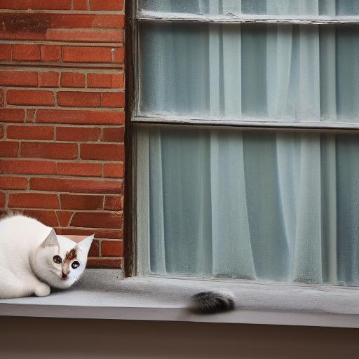
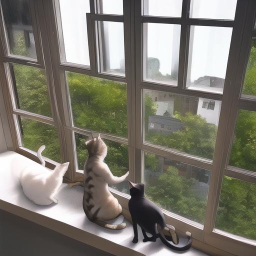

# Sample Images

共通パラメーター: `-p "a cat sitting on a windowsill" --seed 123 --steps 10 --cfg 7.5`

CPU (WSL2) での実行時間を併記しています。

## Stable Diffusion 1.5

| 256x256 (0m28s) | 512x512 (3m11s) |
|:---:|:---:|
|  |  |

256x256 は SD 1.5 の訓練解像度（512x512）と異なるため、まともな画像が生成できません。512x512 ではプロンプト通りの画像が得られます。

## Anything V5

| 256x256 (0m28s) | 512x512 (3m05s) |
|:---:|:---:|
|  |  |

Anything V5 は 256x256 でも比較的良好な結果が得られます。512x512 ではより精細な画像になります。

## 実行コマンド

```bash
# Stable Diffusion 1.5
uv run my-sd15 -p "a cat sitting on a windowsill" --seed 123 --steps 10 --cfg 7.5 -W 256 -H 256 -o samples/sd15-256x256.jpg
uv run my-sd15 -p "a cat sitting on a windowsill" --seed 123 --steps 10 --cfg 7.5 -W 512 -H 512 -o samples/sd15-512x512.jpg

# Anything V5
uv run my-sd15 -m genai-archive/anything-v5 -p "a cat sitting on a windowsill" --seed 123 --steps 10 --cfg 7.5 -W 256 -H 256 -o samples/any5-256x256.jpg
uv run my-sd15 -m genai-archive/anything-v5 -p "a cat sitting on a windowsill" --seed 123 --steps 10 --cfg 7.5 -W 512 -H 512 -o samples/any5-512x512.jpg
```
