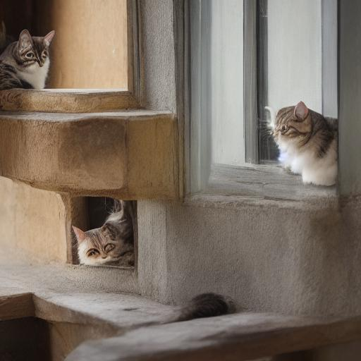

# Sample Images

`make samples` により、画像をまとめて生成します。👉[Makefile](../Makefile)

CPU (WSL2) での実行時間を併記しています。実行時間はステップ数にほぼ比例します。本来 30 程度は必要ですが、時間節約のため 10 に減らしているため、画像の細部が甘くなっています。

共通パラメーター: `-p "a cat sitting on a windowsill" --steps 10 --cfg 7.5 --seed 123`

※ ステップ数 10 は、画像が形になる最低限のステップです。👉[steps](../steps/README.md)

## Stable Diffusion 1.5

モデル: https://huggingface.co/stable-diffusion-v1-5/stable-diffusion-v1-5

256x256 は SD 1.5 の訓練解像度（512x512）と異なるため、まともな画像が生成できません。512x512 ではプロンプト通りの画像が得られます。

| 256x256 (0m28s) | 512x512 (3m07s) |
|:---:|:---:|
|  |  |

## miniSD

モデル: https://huggingface.co/webui/miniSD （[justinpinkney/miniSD](https://huggingface.co/justinpinkney/miniSD) の safetensors 変換版）

miniSD は SD 1.4 を 256x256 でチューニングしたモデルです。256x256 でも比較的良好な画像が生成されます。想定解像度より大きい 512x512 では、パターンの繰り返しが見られます。

| 256x256 (0m28s) | 512x512 (3m07s) |
|:---:|:---:|
|  |  |

## Anything V5

モデル: https://huggingface.co/genai-archive/anything-v5

Anything V5 はアニメ絵に特化したモデルです。256x256 でも形状は認識できますが、細部がやや崩れています。512x512 ではより精細な画像になります。

| 256x256 (0m28s) | 512x512 (3m08s) |
|:---:|:---:|
|  |  |
