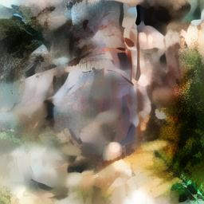

# デノイジングステップの可視化

- 設定: `-m genai-archive/anything-v5 -p "a cat sitting on a windowsill" --seed 123 --cfg 7.5 -W 256 -H 256`

各ステップにおける latent の直接表示と VAE デコード結果を並べて表示します。

Latent は 4×32×32 のテンソルです。4 成分を赤・緑・青・シアンに割り当てた加法混色で可視化しています。各成分はチャンネルごとに平均 0.5・標準偏差 0.5 に正規化しています。

| ステップ | Latent | VAE デコード | 該当ステップ数で生成 |
|----------|--------|-------------|------------------|
| 0 |  |  | （未生成） |
| 1 |  |  |  |
| 2 |  |  |  |
| 3 |  |  |  |
| 4 |  |  |  |
| 5 |  |  |  |
| 6 |  |  |  |
| 7 |  |  |  |
| 8 |  |  |  |
| 9 |  |  |  |
| 10 |  |  | （左と同一） |

## 観察

VAE デコード列を見ると、最初の数ステップで構図と大まかなシルエットが決まり、後半のステップで毛並みや窓枠の質感といった細部が描き込まれていくことが分かります。Progressive JPEG が DCT 係数を低周波から順に送って画像を粗→精と描き出すのと似た構造です。この低周波→高周波の順序はノイズスケジュールの性質によるもので、詳しくは [DDIM Scheduler の解説](../docs/09_ddim.md)を参照してください。

Latent 列と VAE デコード列を比較すると、Latent がまだノイズだらけに見えるステップでも、VAE デコードするとすでに意味のある画像が浮かび上がっています。Latent の可視化は 4 成分を単純に色に割り当てたものに過ぎないのに対し、VAE Decoder は学習済みの知識を使って潜在表現をピクセル空間に復元するため、情報量に大きな差があります。

この過程は、人間が雲の形に顔を見出す「パレイドリア」と似た構造を持っています。U-Net はランダムノイズに対して、学習した画像の確率分布とプロンプトの条件を手がかりに「この潜在表現はどんな画像であるべきか」を推論し、ステップごとにその解釈を強めていきます。途中段階のぼんやりしたシルエットが徐々に被写体として収束していく様子は、まさにモデルがノイズの中からパターンを削り出していく過程そのものです。
